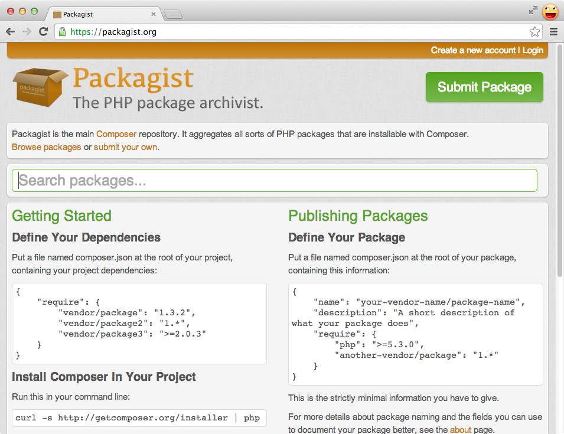
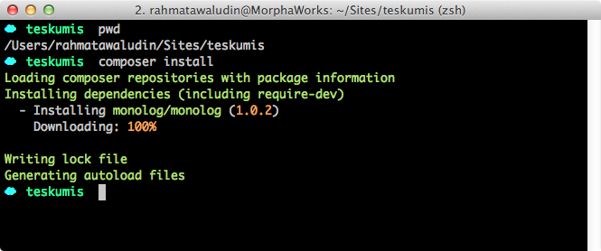
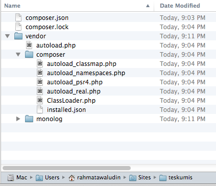
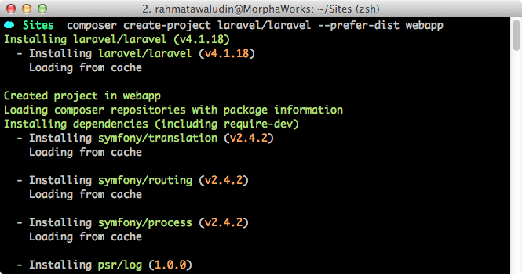
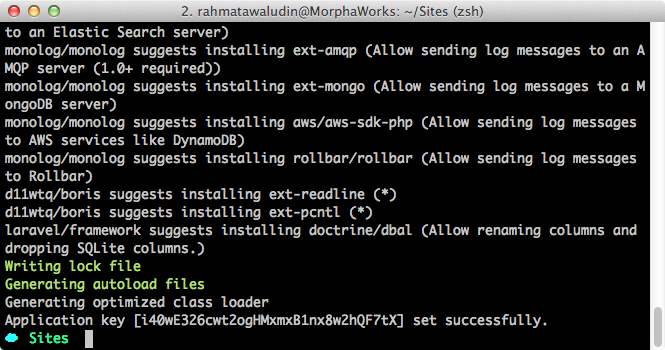
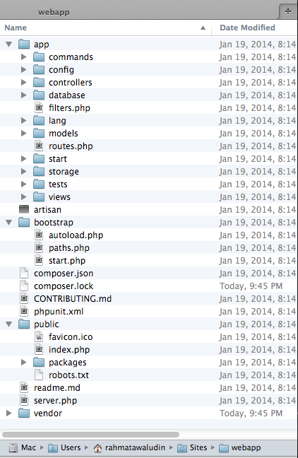
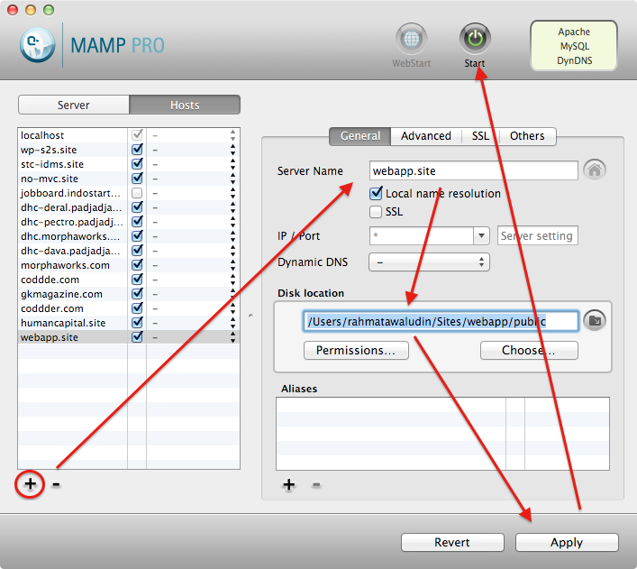

# Hari 1 : Instalasi dan Konfigurasi Laravel

Laravel sangat mudah dikonfigurasi untuk mengembangkan sebuah aplikasi. Pada bagian ini akan saya jelaskan apa saja yang harus dipersiapkan untuk memulai menggunakan framework Laravel. Untuk memudahkan pemahaman, saya tidak akan menjelaskan beberapa istilah secara rinci.

## Kebutuhan Sistem
Laravel mendukung penggunaa
n web server apache dan ngix. Pada buku ini, saya menggunakan web server Apache. Pastikan PHP yang Anda gunakan sudah versi 5.3.7 keatas. Saya sendiri menggunakan [MAMP](www.mamp.info) untuk OSX, jika Anda pengguna windows bisa menggunakan [XAMPP](www.apachefriends.org).

Untuk database Laravel dapat menggunakan database MySQL, PostgreSQL, SQLServer atau SQLite.

## Composer
Untuk menginstall laravel kita akan menggunakan composer. Composer adalah aplikasi yang digunakan untuk mengatur package-package dalam mengembangkan sebuah web dengan PHP. Jika dulu, mungkin Anda mengenal yang namanya [PEAR](pear.php.net), composer tuh mirip-mirip PEAR lah.

Anggaplah kita belum kenal dengan PEAR/Composer. Jika kita akan mengembangkan sebuah aplikasi web dan membutuhkan library untuk user management misalnya 'UserAuth' maka kita akan download dari webnya, letakkan di folder tertentu (misalnya library), kemudian me-load dengan `require` atau `include` pada class yang kita butuhkan.

Setidaknya ada beberapa masalah dari solusi ini:

* Bagaimana jika web kita membutuhkan tidak hanya satu library, tapi 40 library? Mau download satu-persatu?
* Bagaimana jika library `UserAuth` bergantung dengan library lain? misalnya `SessionManager` dan `SessionManager` juga bergantung kepada library `Session`. Dan seterusnya, dan seterusnya..

Pada Laravel, kita akan menggunakan composer tidak hanya untuk menginstall library, tapi framework Laravel itu sendiri diinstall menggunakan composer.

Untuk memahami composer lebih lanjut, Anda dapat mengunjungi [dokumentasi resmi composer](https://getcomposer.org/doc/00-intro.md).

### Install Composer
Instalasi composer agak berbeda untuk OS *nix (Linux, OSX, dll) dan Windows, saya jelaskan masing-masing:

#### Windows
Cukup download [composer-setup.exe](https://getcomposer.org/Composer-Setup.exe) dan jalankan file instalasi.

#### *nix
Jalankan terminal dan masukkan perintah berikut:

~~~~~~~~
$ curl -sS https://getcomposer.org/installer | php
$ sudo mv composer.phar /usr/local/bin/composer
~~~~~~~~

### Penggunaan Composer
Secara default, composer akan menggunakan package yang teregister di [packagist.org](http://packagist.org). Tentunya, kita juga dapat menyiapkan repositori package private menggunakan [satis](https://github.com/composer/satis).

Composer menggunakan file dengan [format JSON](http://json.org). JSON merupakan format standar untuk menyimpan data name=>value yang sudah sangat umum digunakan untuk transfer data. Contoh syntax JSON terlihat seperti ini:

{title="contoh struktur JSON", lang="javascript", lineos=on}
~~~~~~~~
{
    name1 : {
        subname1 : value,
        subname2 : value
    },
    name2 : value
}
~~~~~~~~

Composer menggunakan format json ini pada file bernama `composer.json`. Berikut contoh isi `composer.json` :

{title="composer.json", lang="javascript", lineos=on}
~~~~~~~~
{
    "require": {
        "monolog/monolog": "1.0.*"
    }
}
~~~~~~~~

Sebagaimana terlihat pada syntax diatas, pada bagian `require` kita masukkan `nama package` yang kita butuhkan (monolog/monolog) dan `versi` yang diinginkan (1.0.*).

#### Install Package
Untuk menginstall package dengan composer, pindahkan file `composer.json` diatas ke sebuah folder. Lalu jalankan perintah berikut di dalam folder tersebut:

~~~~~~~~
$ composer install
~~~~~~~~

Perintah diatas akan melakukan instalasi package aplikasi yang kita tulis di bagian require. Setelah dieksekusi strutur folder kita akan berubah:

Folder `vendor` menyimpan package yang dibutuhkan, sebagaimana yang ditulis di bagian `require`
File `vendor/autoload.php` dapat digunakan untuk mendapatkan fitur autoloading.
File `composer.lock` berfungsi mencatat versi package yang saat ini sedang kita gunakan, jangan hapus/edit file ini, karena perintah `composer install` bergantung pada file ini.

#### Update package
Jika package baru telah ditambah pada bagian `require` atau versi package yang digunakan dirubah, gunakan perintah ini untuk memperbaharui package yang kita gunakan:

~~~~~~~~
$ composer update
~~~~~~~~

Perintah composer lainnya dapat dilihat dengan perintah :

~~~~~~~~
$ composer --help
~~~~~~~~
Atau cek di [manual composer](https://getcomposer.org/doc).

## Instalasi Laravel
Sebagaimana disampaikan di bagian sebelumnya, Laravel diinstall menggunakan composer. Gunakan perintah ini untuk membuat project laravel di folder webapp:

~~~~~~~~
$ composer create-project laravel/laravel --prefer-dist webapp
~~~~~~~~

Perintah ini akan menginstall framework laravel dan dependency packagenya.

Jika Anda menggunakan OS *nix, instalasi laravel dapat pula dilakukan dengan menggunakan `laravel.phar`, caranya:

1. Download [Laravel phar](http://laravel.com/laravel.phar)

    {linenos=off}
    ~~~~~~~~
    $ wget http://laravel.com/laravel.phar
    ~~~~~~~~

2. Rename file yang telah didownload menjadi `laravel`

    {linenos=off}
    ~~~~~~~~
    $ mv laravel.phar laravel
    ~~~~~~~~

3. Pindahkan file tersebut ke `/usr/local/bin/`:

    {linenos=off}
    ~~~~~~~~
    $ sudo mv laravel /usr/local/bin/
    ~~~~~~~~

4. Untuk membuat project laravel, jalan perintah :

    {linenos=off}
    ~~~~~~~~
    $ laravel new webapp
    ~~~~~~~~

## Konfigurasi
Setelah Laravel terinstall pastikan folder app/storage dapat diakses oleh web server. Cara sederhananya, jalankan perintah ini:

{linenos=off}
~~~~~~~~
$ sudo chmod -R 777 app/storage
~~~~~~~~

Jangan lupa isi juga konfigurasi database Anda (nama database, username, password) di `app/config/database.php`. Tentunya database harus Anda buat sendiri di aplikasi database yang Anda gunakan.

## Menjalankan Web Server
Web yang dikembangkan dengan Laravel dapat diakses menggunakan PHP builtin web server atau virtual host.

### PHP builtin web server
Jalankan perintah berikut di folder webapp:

{linenos=off}
~~~~~~~~
$ php artisan serve
~~~~~~~~

Setelah Anda menjalankan perintah diatas, aplikasi laravel dapat diakses di http://localhost:8000. Kekurangan dari PHP Builtin web server adalah ketika terjadi perubahan pada source code, terkadang server harus di restart.

### Virtual Host
Menggunakan virtual host, aplikasi dapat diakses dengan url seperti http://webapp.site, http://www.webapp.com, dan sebagainya walupun masih berada di lokal. Saya sendiri lebih sering menggunakan virtualhost ketika mengembangkan web dengan Laravel. Berikut cara membuat virtual host:

#### MAMP
1. Menggunakan MAMP Pro, buka menu **Hosts**
2. Klik tombol [+]
3. Isi bagian **Server name** dengan url yang kita inginkan
4. Isi **Disk Location** dengan alamat folder public di webapp
5. Klik **Apply**
6. Klik **Start** untuk merestart server apache.

#### XAMPP
1. Buka file `hosts` yang ada di alamat  `C:\WINDOWS\system32\drivers\etc\hosts`
2. Di bagian paling bawah tambahkan alamat IP Address localhost 127.0.0.1  dan nama domain yang dibuat misalnya webapp.site

    {title="C:\WINDOWS\system32\drivers\etc\hosts", linenos=on}
    ~~~~~~~~
    ....
    127.0.0.1    webapp.site
    ....
    ~~~~~~~~

3. Buka file `httpd.conf` yang ada di alamat `C:\xampp\apache\conf\httpd.conf`

4. Cari bagian `Directory`, jika aplikasi kita berada di `C:/xampp/htdocs/webapp` isi seperti ini

    {title="C:\xampp\apache\conf\httpd.conf", linenos=on}
    ~~~~~~~~
    <Directory "C:/xampp/htdocs/webapp/public">
      Options Indexes FollowSymLinks Includes ExecCGI
      AllowOverride All
      Order allow,deny
      Allow from all
      Require all granted
    </Directory>
    ~~~~~~~~

5. Buka file `httpd-vhosts.conf`  yang ada di alamat `C:\xampp\apache\conf\extra`

6. Tambahkan setingan di bawah ini untuk membedakan website yang dipanggil dengan localhost dan website yang dipanggil dengan virtual host

    {title="C:\xampp\apache\conf\extra\httpd-vhosts.conf", lineos=on}
    ~~~~~~~~
    NameVirtualHost *:80

    #VirtualHost untuk webapp.site

    <VirtualHost *:80>
      DocumentRoot C:/xampp/htdocs/webapp/public
      ServerName webapp.site
    </VirtualHost>

    #Untuk localhost yang biasa

    <VirtualHost *:80>
      DocumentRoot C:/xampp/htdocs
      ServerName localhost
    </VirtualHost>
    ~~~~~~~~

7. Restart Apache pada XAMPP Control Panel dengan klik tombol **stop** kemudian klik tombol **start**.

Setelah berhasil, Anda dapat mengakses aplikasi di http://webapp.site.

## Ringkasan
Pada hari 1 ini, saya harap Anda telah dapat memahami:

  * Penggunaan composer untuk development php modern
  * Instalasi laravel
  * Konfigurasi virtualhost

Pada hari 2 kita akan mempelajari konsep Routing dan MVC pada Laravel. Semangat! :)